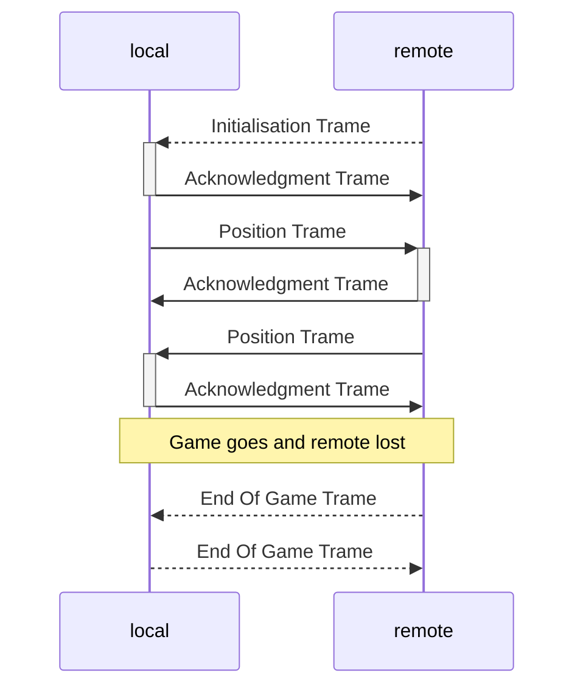

## Communication Protocole Breakdown
The communication during a normal game look like this:

```mermaid
sequenceDiagram
    participant local
    participant remote
    remote-->>+local: Initialisation Trame
    local->>-remote: Acknowledgment Trame
    local->>+remote: Position Trame
    remote->>-local: Acknowledgment Trame
    remote->>+local: Position Trame
    local->>-remote: Acknowledgment Trame
    Note over local, remote: Game goes and remote lost
    remote-->>local: End Of Game Trame
    local-->>remote: End Of Game Trame
```

## Trame Breakdown
Each trame is encoded using only one data bit, and one seperator bit

```mermaid
gantt
    title Initialisation Frame
    dateFormat X
    axisFormat %S
    section Local
        Seperator       :0, 15
        Data            :15, 30
        Data            :30, 45
        Separator       :45, 60
```

```mermaid
gantt
    title Acknowledgment Trame
    dateFormat X
    axisFormat %S
    section Remote
        Seperator       :0, 15
        Data            :15, 30
        Seperator       :30, 45
            
```
